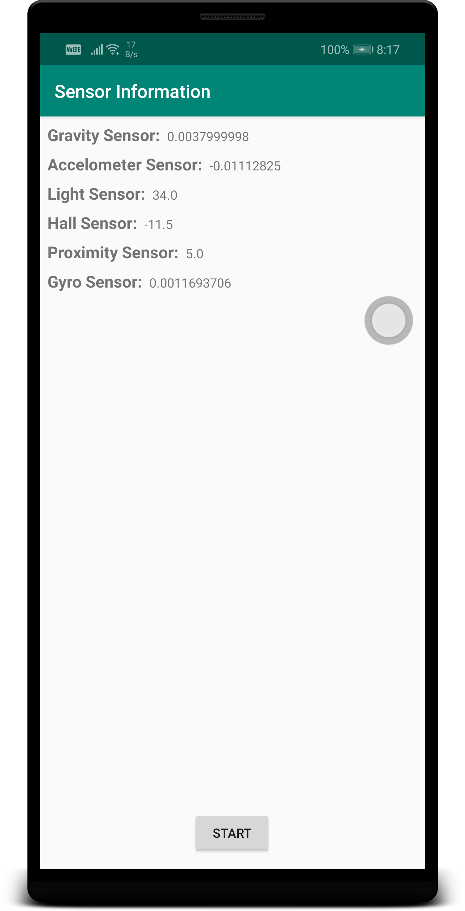

# Sensor Reading from Android

## Sensors available in Huawei nova 3i

[X] accelerometer-lsm6ds3-c
* mag-akm09918
* orientation
[X] light-ltr578
* proximity-ltr578
* st-lsm6ds3
* [X] gravity
* linear Acceleration
* rotation Vector
[X] HALL sensor
* uncalibrated Magnetic Field
* game Rotation Vector
* uncalibrated Gyroscope
* significant Motion
* step counter
* geomagnetic Rotation Vector
* phonecall sensor
* RPC sensor

## References

1. [Android Official Documentation on Sensors](https://developer.android.com/guide/topics/sensors/sensors_overview#java)